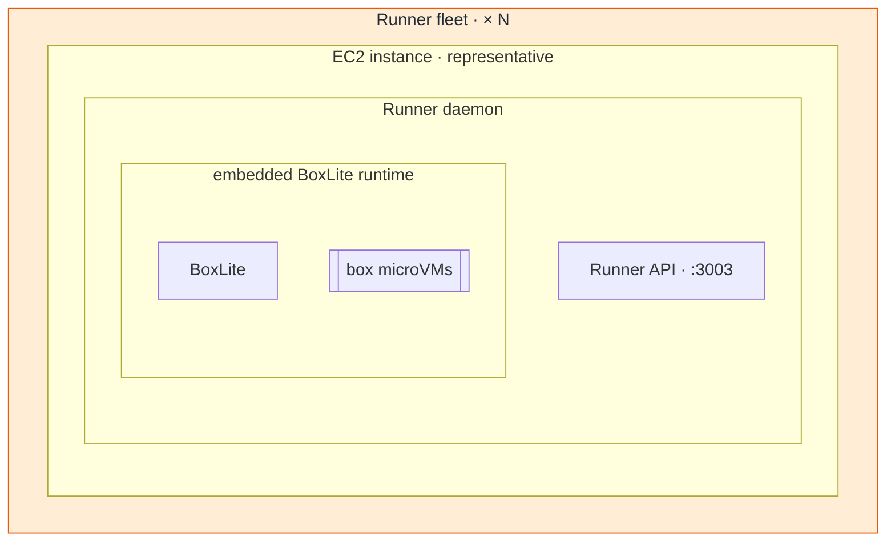
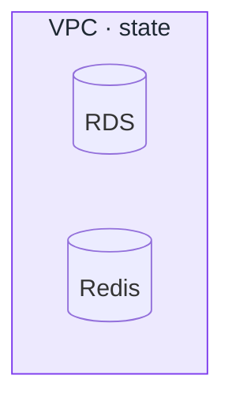

# Architecture composition

Read this reference whenever the requested output is an architecture,
deployment, topology, overview, or rendered picture.

## Contents

- [BoxLite house reference](#boxlite-house-reference)
- [Pick one altitude](#pick-one-altitude)
- [Model containment before routes](#model-containment-before-routes)
- [Place hosted-cloud components](#place-hosted-cloud-components)
- [Group related components into scope zones](#group-related-components-into-scope-zones)
- [Compose for a normal-width render](#compose-for-a-normal-width-render)
- [Color zones with the house palette](#color-zones-with-the-house-palette)
- [Run visual QA](#run-visual-qa)

## BoxLite house reference

Start with the existing diagram closest to the request. For the hosted cloud
deployment, use
[`apps/infra/docs/deployment.md#architecture`](../../../../apps/infra/docs/deployment.md#architecture)
as the composition baseline. It establishes the BoxLite house style:

- keep users and external dependencies outside owned infrastructure;
- separate public ingress from private compute;
- group state and observability by operational role;
- keep every functional scope one contiguous, palette-colored zone;
- distinguish actors, services, storage, and box microVMs by shape;
- put only useful domain, protocol, port, runtime, and constraint details in
  labels;
- draw only high-value request, control, image, telemetry, and data routes.

If the canonical diagram predates the scope palette, keep its composition and
apply the zone grouping and colors when reusing it.

Reuse the canonical layout when it answers the question, but treat its
containment as a hypothesis. Verify every deployment boundary against current
IaC and source before copying it. Do not reconstruct the system from low-level
call paths merely because more source exists.

## Pick one altitude

State the diagram's question in one sentence before drawing. Examples:

- "How public traffic reaches private BoxLite services and boxes."
- "How the runner creates and starts one box."
- "What changed between the PR base and head."

Every node must help answer that sentence. A deployment overview names deployed
systems and boundaries, not individual functions. A source call graph names
functions, not every cloud resource.

"Entire deployment architecture" means complete coverage at the deployment
altitude, not every AWS resource. Include:

1. user and SDK entry points;
2. external identity, DNS, registry, or telemetry dependencies that affect the
   main path;
3. public ingress and routing;
4. network, host, process, and trust boundaries needed to understand ownership;
5. deployed compute and the box execution boundary;
6. durable state and caches;
7. the main control, data, image, and observability routes.

Combine siblings with the same boundary and role when their individual identity
does not change a route. Add a second diagram only when the user asks for a
different altitude.

## Model containment before routes

Distinguish containment from communication:

- "inside," "runs on," "owns," and "embeds" require surrounding subgraphs;
- "calls," "routes to," "polls," "mounts," and "exports" require arrows;
- never use an arrow as a substitute for ownership;
- never place an embedded component beside its host.

Give every real boundary a canonical lowercase snake-case Mermaid subgraph ID.
Declare the same boundary and each immediate member in
`evidence.json.boundaries`. The validator compares the manifest with the actual
nesting; indentation alone is not evidence.

For the hosted runner path, preserve this source-backed containment:

`Runner fleet → EC2 instance × N → Runner daemon → embedded BoxLite runtime → box microVMs`

Draw one representative EC2 unit and label the repeated layer `× N`; do not
clone identical instances. Use this shape:



The outer fleet doubles as the execution zone and carries the scope color; the
nested EC2, process, and runtime boundaries are purely physical and stay
unstyled. Model every step, not merely the outer fleet. `Runner fleet` surrounds the
representative `EC2` boundary; EC2 surrounds the Runner process; Runner
surrounds the embedded BoxLite runtime; BoxLite surrounds the microVMs it
creates and manages.

Deep nesting is justified for this ownership chain because flattening it changes
the architecture's meaning. Keep unrelated state, telemetry, and ingress
grouping shallow so the overall picture remains readable.

## Place hosted-cloud components

Verify these placements against current IaC before drawing because they can
drift:

- keep the browser, SDK/CLI, Cloudflare DNS, OIDC provider, and image registry
  outside BoxLite-owned AWS boundaries;
- keep CloudFront in the AWS/global edge but outside the VPC;
- surround ALB/NLB resources with the VPC public-ingress boundary;
- surround ECS/Fargate API, Proxy, and internal tools with the VPC private
  service boundary;
- surround the Runner fleet with the VPC public-runner-subnet boundary;
- place RDS and Redis inside their VPC state boundary;
- keep regional S3 outside the VPC; draw its VPC gateway endpoint or route only
  when that access distinction matters.

Do not label a box "public edge" and then use it to imply that every enclosed
resource is outside the VPC. A route category and a deployment boundary are
different concepts.

## Group related components into scope zones

Mermaid's auto-layout has no "keep these together" hint: it scatters related
components unless the diagram makes relatedness structural. Make it structural
with scope zones.

- Assign every architecture node to exactly one functional scope: `external`,
  `edge`, `compute`, `execution`, `state`, or `observability`.
- A scope's members form one zone: a subgraph that surrounds them. When an
  existing physical boundary already groups exactly that scope (the VPC state
  boundary, the runner fleet), reuse that boundary as the zone instead of
  double-wrapping it.
- Declare a zone's members on consecutive lines and order zones along the main
  request path — external, then edge, then compute, then execution — with
  state and observability zones beside the services they serve. Declaration
  order is the strongest layout influence you have.
- Keep every zone contiguous in the rendered image. A scope split into two
  islands defeats the zone; move members or reroute edges until each scope is
  one region.
- Zones are boundaries in the manifest too: declare the zone's subgraph in
  `evidence.json.boundaries` with its immediate members and set its `scope`
  field so the validator checks the zone's palette class instead of trusting
  it.
- A zone is grouping, not ownership. Real containment still follows
  [Model containment before routes](#model-containment-before-routes); never
  invent a zone that contradicts a physical boundary.

## Compose for a normal-width render

- Prefer `flowchart TB` for a whole deployment and `LR` for a short path.
- Put the main request/control path near the center and supporting systems
  around it.
- Keep sibling boundaries and zones disjoint. If Mermaid overlaps them, change
  direction, edge placement, or grouping and render again.
- Write edge statements in main-path order first; edge order is the second
  layout lever after declaration order and reduces crossings.
- Route no edge through a zone it does not connect to. If an edge cuts across
  an unrelated zone, reorder declarations or move the zone.
- Use short labels. Add a second or third line only for a domain, port,
  protocol, implementation, scale marker, or operational constraint.
- Use rounded actors, rectangles for services, cylinders for state, and a
  distinct shape for microVMs.
- Label important edges with traffic or control meaning. Leave obvious
  forwarding edges unlabeled only when the relationship remains unambiguous.
- Aim for roughly 12–20 nodes. Boundaries do not consume the same budget when
  they replace misleading ownership arrows.
- Avoid service logos, decorative icons, and dense legends.

Mermaid may ignore a subgraph's requested direction when its nodes connect
outside that subgraph. Treat the rendered result—not source indentation or a
`direction` statement—as the layout truth.

## Color zones with the house palette

Every zone carries its scope's fixed color so a reader identifies regions at a
glance and the same scope looks the same in every BoxLite diagram. The palette
is the complete list of permitted styling; the validator rejects any other
`classDef`, any altered definition, and all `style`/`linkStyle`/theme
directives.

| Scope | Meaning | Exact `classDef` line |
| --- | --- | --- |
| `external` | users, SDKs, third-party dependencies | `classDef scope_external fill:#eceff1,stroke:#607d8b,color:#1f2933` |
| `edge` | public ingress and routing | `classDef scope_edge fill:#dbeafe,stroke:#2563eb,color:#1f2933` |
| `compute` | private services and internal tools | `classDef scope_compute fill:#dcfce7,stroke:#16a34a,color:#1f2933` |
| `execution` | runners and the box execution boundary | `classDef scope_execution fill:#ffedd5,stroke:#ea580c,color:#1f2933` |
| `state` | durable state and caches | `classDef scope_state fill:#ede9fe,stroke:#7c3aed,color:#1f2933` |
| `observability` | telemetry, logs, metrics | `classDef scope_observability fill:#fef3c7,stroke:#d97706,color:#1f2933` |

Usage:



```json
{
  "id": "vpc_state",
  "label": "VPC · state",
  "scope": "state",
  "...": "states, views, proposed, members, evidence as usual"
}
```

Rules:

- copy the `classDef` line verbatim for each scope the diagram uses, and
  assign it with `class <zone_id> scope_<name>`;
- color zone subgraphs only. Individual nodes and purely physical boundaries
  (a host, a process, a subnet outline inside a zone) stay unstyled so the
  physical/zone distinction survives in the render;
- declare the matching `scope` on the zone's `evidence.json` boundary entry;
  the validator cross-checks declared scopes against drawn classes;
- color reinforces the zone title; the title still names the scope in text;
- sequence diagrams and call graphs take no styling.

The muted fills with explicit dark text are self-contained: they render
identically and stay legible on light/dark hosts, including GitHub READMEs.
An exported SVG or PNG is still a static preview; keep the live Mermaid block
as the source of truth and inspect a light and a dark render when the
destination's contrast matters.

## Run visual QA

After deterministic validation, open every generated PNG at normal fit-to-page
size and check the picture:

1. The title or prose states the scope.
2. The main path can be followed in a few seconds.
3. Each parent visibly surrounds every declared immediate member.
4. External, AWS, VPC, subnet, host, process, runtime, state, and telemetry
   boundaries are truthful and disjoint.
5. Related components sit together: every scope is one contiguous zone tinted
   with its house palette color, and unstyled physical boundaries remain
   visually distinct from colored zones.
6. Labels remain legible without zooming and are not clipped.
7. Arrows do not cross unrelated nodes or zones or imply false
   ownership/direction.
8. No large empty region or long return edge distorts the layout.
9. Every item promised by the scope sentence appears.
10. The palette-colored Mermaid remains readable in light/dark themes.

If any check fails, revise and render again. Syntax success and source evidence
do not constitute a visual-quality pass.
