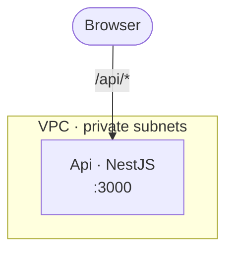
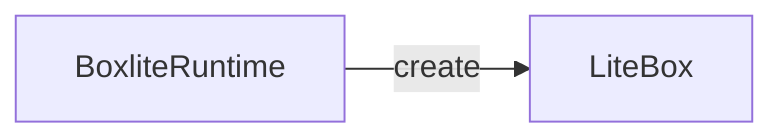
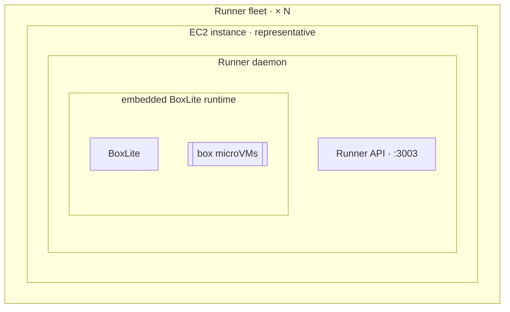

# BoxLite diagram output contract

## Select only the useful views

`evidence.json` may declare a non-empty `views` array in this canonical order:

1. `architecture`
2. `sequence`
3. `call_graph`

Omitting `views` keeps backward compatibility and selects all three. Every
node and edge membership must be a subset of the selected views.

Choose views from the user's question:

- deployment, topology, boundary, overview, or rendered picture:
  `['architecture']` by default;
- ordering, retries, concurrency, or failure: `['sequence']`;
- source mechanics or a function path: `['call_graph']`, adding sequence only
  when time or concurrency matters;
- before/after change: the smallest view set that makes the change unambiguous.

Three views are useful only when each answers a different question. Repeating
the same inventory three ways makes the result harder to understand.

## Document

`diagram.md` contains exactly the selected level-two sections in canonical
order. Each section contains exactly one level-three subsection for every state
listed in `evidence.json`, in the same order. Architecture and sequence state
sections contain one `mermaid` fence. Call-graph state sections contain one
`text` fence.

Architecture fences start with `flowchart` or `graph`. Sequence fences start
with `sequenceDiagram`.

An architecture-only overview is valid:

````markdown
## Architecture

### Current


````

For bug-fix PRs, put `Fixes #<number>` on a standalone line after the last
selected view.

## Architecture IDs

Declare nodes with their manifest IDs:



The Mermaid edge ID (`create_box`) is also the manifest edge ID. `<br/>` is the
only allowed HTML-like tag and is used only for deliberate label wrapping.

## Architecture boundaries

Give every meaningful subgraph a lowercase snake-case ID and declare it in the
manifest. Use nested subgraphs for hosting or embedding, and arrows only for
communication. The BoxLite deployment's execution containment is:

`Runner fleet → EC2 instance × N → Runner daemon → embedded BoxLite runtime → box microVMs`



Declare each immediate parent-child relationship; do not skip from fleet
directly to Runner or place BoxLite beside Runner:

```json
{
  "id": "runner_process",
  "label": "Runner daemon",
  "states": ["current"],
  "views": ["architecture"],
  "proposed": false,
  "members": [
    {"target": "node:runner_api", "states": ["current"]},
    {"target": "boundary:embedded_boxlite", "states": ["current"]}
  ],
  "evidence": []
}
```

In a real manifest, every boundary has revision-aware source or issue evidence,
just like a node or edge. One target may have only one immediate parent per
state, and boundary cycles are invalid.

## Sequence IDs

Participants use manifest node IDs. Every message is immediately preceded by a
manifest edge ID comment:

```mermaid
sequenceDiagram
  participant runtime as BoxliteRuntime
  participant box as LiteBox
  %% edge:create_box
  runtime->>box: create box<br/>File: src/boxlite/src/runtime/core.rs<br/>Namespace: boxlite::runtime::core<br/>Class: BoxliteRuntime<br/>Function: create<br/>LOC: L291-L300
```

Notes and grouping statements may be untracked because they are not edges.

Keep the message's action short, then explicitly label every source field:

`<action><br/>File: <path><br/>Namespace: <full-chain><br/>Class: <owner><br/>Function: <name><br/>LOC: L<start>-L<end>`

- `File` is the repository-relative path.
- `Namespace` is the complete declared crate, module, or package chain from the
  outermost scope to the innermost scope. Preserve every nested segment and use
  the language's native separator. Use `Namespace: —` when none exists.
- `Class` is the owning class, struct, type, or receiver. Use `Class: —` for a
  free function so the field remains explicit.
- `Function` is the unqualified function or method name.
- `LOC` is the exact inclusive line range.

Do not show only some of these fields. Omit the entire source block only when no
concrete source symbol exists, such as an external interaction or explicitly
proposed behavior. Never invent a value to fill the format.

For a source-backed sequence call, the target node's source evidence uses the
complete language-native symbol chain. The example above therefore uses
`boxlite::runtime::core::BoxliteRuntime::create`, allowing the validator to
derive and check `Namespace`, `Class`, and `Function` independently.

## Call graph

Each hop is a single line:

```text
  create (BoxliteRuntime · src/boxlite/src/runtime/core.rs:291) — public boundary
    └─ create (RuntimeImpl · src/boxlite/src/runtime/rt_impl.rs:385) — persist configuration
```

Rules:

- two spaces before a root hop;
- two additional spaces for each depth;
- a child uses `└─` or `├─` after its indentation;
- the displayed line must be inside the matching manifest evidence range;
- indentation creates a caller-to-callee edge that must exist in the manifest;
- `← BUG: <description>` belongs on a faulty `Before`/`Current` hop, never on a
  standalone line;
- future behavior has no invented hop—annotate the last real boundary instead.

## Evidence types

Source evidence:

```json
{
  "type": "source",
  "state": "current",
  "revision": "HEAD",
  "path": "src/boxlite/src/runtime/core.rs",
  "line_start": 291,
  "line_end": 299,
  "symbol": "boxlite::runtime::core::BoxliteRuntime::create",
  "tokens": ["pub async fn create", "self.backend.create"]
}
```

Issue evidence for behavior that is explicitly proposed:

```json
{
  "type": "issue",
  "state": "expected",
  "issue": 1209,
  "tokens": ["volume creation", "mount"]
}
```

Tokens are exact, case-sensitive substrings of the cited source range or
case-insensitive substrings of the issue title/body.

## Manifest membership

Each node, edge, and boundary declares the states and selected views where it
appears. Shared entities reuse the same canonical ID; view-specific context is
allowed when it materially improves that view.

Every parsed Mermaid node, Mermaid edge, sequence participant/message, and call
graph hop/relationship must map to exactly one declared manifest item. When the
manifest declares `boundaries`, every Mermaid subgraph and every immediate
node/subgraph parent must match it exactly.

## Annotation targets

Annotations target `node:<id>` or `edge:<id>` and include one state:

```json
{
  "kind": "BUG",
  "target": "edge:signal_pid",
  "state": "before",
  "text": "a recycled PID can identify another process"
}
```

Use `ISSUE`, `BUG`, `FIX`, `PROPOSED`, `ADDED`, `CHANGED`, or `REMOVED`. For
diff annotations, the target's evidence must intersect the correct base/head
diff hunk.

## Rendered artifacts

The validator emits `.mmd`, `.svg`, and `.png` artifacts for every Mermaid
block. The PNG exists for visual inspection. A successful validation report
proves syntax and traceability, not composition; inspect the PNG before calling
the result ready. Keep README Mermaid free of fixed themes and styles so GitHub
controls light/dark rendering. Treat a PNG as a static preview and inspect both
light and dark renders when the destination's contrast is important.
